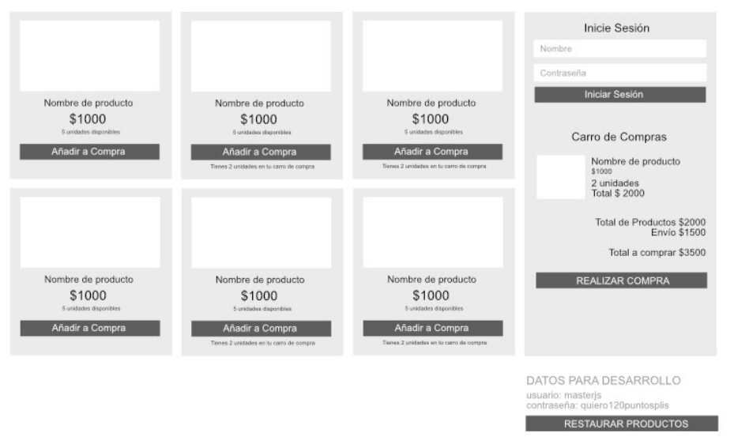

# Tiempo de desarrollo: 4 semanas.
Fecha límite entrega:  25 de Septiembre 2021 
Forma de entrega: Link a repositorio Github con el proyecto, el link debe ser entregado mediante Classroom en la actividad creada para este fin. 

## Descripción general del proyecto 

Se debe realizar en modo SPA (Single Page Application) una tienda de comercio electrónico con las siguientes características: 
Se debe utilizar HTML, CSS y Javascript o Typescript, no se permitirá el uso de frameworks (React, Angular u otro). 
En caso de estar realizado en Typescript no debe incluir los archivos compilados a JS. 
El proyecto solo debe contener 1 archivo html (index.html). 
El usuario debe ser capaz de ver una variedad de productos y añadirlos a un carro de compra. 
El usuario debe poder autenticarse, la validación debe ser estática y se debe aclarar cuál será el usuario y contraseña para uso del ejercicio. 
La posibilidad de iniciar sesión no debe estar disponible si el usuario ha iniciado sesión, y en ese caso debe mostrar el nombre del usuario. 
La cuenta de usuario no debe persistir cuando el usuario sale del sitio (cierra la pestaña o cierra el navegador). 
Cada producto debe tener 1 imagen, 1 título, 1 precio y stock disponible (entre 1 y 5 unidades). 
Cada producto debe indicar si ese producto se encuentra  en el carro de compras y en qué cantidad, permitiendo añadir más del mismo ítem. 
El usuario no debe ser capaz de solicitar una cantidad mayor a la disponible. 
El stock de productos debe persistir ante la recarga de la página y si el usuario sale del sitio. 
El carro de compra debe persistir sus datos aún cuando el usuario realice una recarga de la página o si el usuario sale del sitio. 
El carro de compra debe calcular el total de la compra en base al valor de los productos seleccionados, añadir un costo de $1500CLP por envío (US$ 2) y $350CLP (US$0,5) por cada producto. 
El carro de compra debe tener un botón de compra, que solo debe estar habilitado si el usuario ha iniciado sesión. 
Al realizar la compra, se debe simular una petición asíncrona que se demore 3 segundos en responder. 
Se debe notificar al usuario que la compra está siendo realizada, mientras esto sucede, el usuario no debe ser capaz de añadir nuevos productos ni realizar otra compra. 
Cuando se realiza la compra, el carro de compra debe ser vaciado y mostrar un mensaje de compra exitosa, pero permitiendo que el usuario sea capaz de volver a realizar una compra. 
El descuento de productos del stock general debe realizarse una vez realizada la compra 
Se debe añadir un botón al pie que permita restaurar los valores por defecto de la cantidad de productos.  

## Para la evaluación se considerarán las siguientes áreas: 

(20 puntos) Limpieza del código, orden y fácil lectura/comprensión.  
(10 puntos) Uso de ECMAScript 6 para declaración de variables, métodos de alto nivel, destructuración, entre otros. 
(30 puntos) Separación de labores del código, ya sea mediante clases o programación funcional, cada parte del código debe tener una labor específica y única. 
(20 puntos) Código a prueba de terceros, se realizará prueba simulando ser otro desarrollador que intentará añadir nuevos productos, modificar valores y cantidades de los ya existentes. El código debe estar preparado para estas labores y evitar que el nuevo desarrollador modifique otras variables que no correspondan, además se deben considerar estás modificaciones para el botón de restauración de las cantidades. 
(60 puntos) Cumplimiento del listado de requerimientos. 

Máximo puntaje posible a obtener 140 puntos 
Nivel de exigencia para aprobación 60% 
Puntaje mínimo para aprobación 83 puntos 

Se añade vista esquemática del proyecto, esto es solo a modo de recomendación y aclaración.  

## TODO
## Semántica WEB HTML5

- [x] ~~Documento HTML5~~
  - [x] ~~FONTS~~
  - [x] ~~Estructura GRID~~
    - [x] ~~ARTICLE~~
    - [x] ~~ASIDE~~
- [x] ~~DIV GRID Article~~
  - [x] ~~Productos GRID~~ 
  - [x] ~~Imagen~~
  - [x] ~~Título~~
  - [x] ~~Precio~~
  - [x] ~~Stocḳ~~
  - [x] ~~Botón de compra~~
  - [x] ~~Estado pedido~~
- [x] ~~ASIDE~~
  - [ ] Crear Login
  - [ ] Crear Empy Cart
  - [ ] Crear Cart
  - [ ] Crear Botón Comprar
  - [ ] Crear mensaje compra 

## CSS3
- [x] ~~GRID~~
- [x] ~~COLORES~~
- [x] ~~Media Responsive~~

